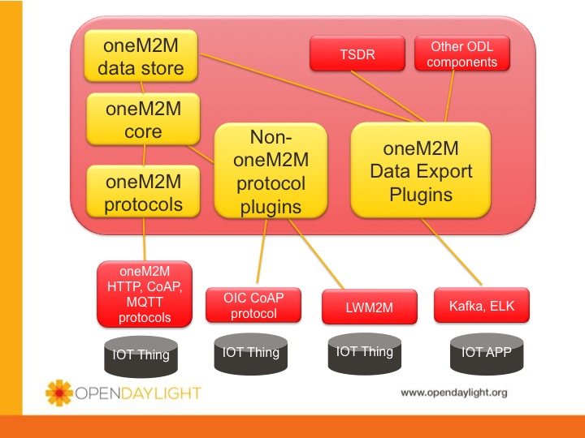
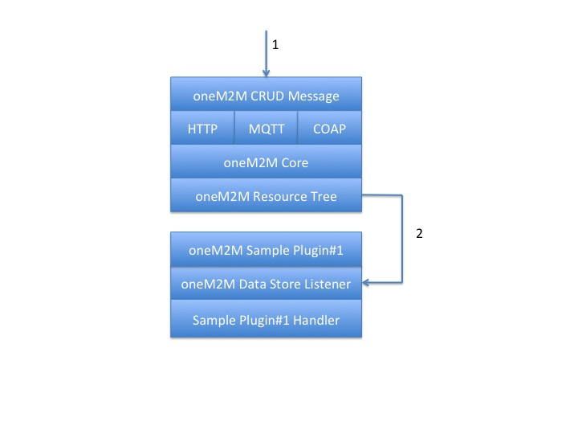

# IoTDM: OneM2M Plugins

# Overview

## OneM2M

The Internet of Things Data Management (IoTDM) on OpenDaylight (ODL) project is about developing a data-centric middleware
that will act as a oneM2M compliant IoT Data Broker and enable authorized applications to retrieve IoT data uploaded by
any device. The ODL platform is used to implement the oneM2M data store which models a hierarchical containment tree,
where each node in the tree represents an oneM2M resource. Typically, IOT devices and applications interact with the
resource tree over standard protocols such as CoAP, MQTT, and HTTP.

Initially, the oneM2M resource tree is used by applications to retrieve data. Possible applications are inventory/device
management systems or big data analytic systems designed to make sense of the data collected. But, at some point,
applications will need to configure the devices. Features and tools will have to be provided to enable configuration of
the devices based on applications responding to user input, network conditions, or some set of programmable rules or
policies possibly triggered by the receipt of data collected from the devices.

The ODL platform, with its rich unique cross-section of SDN capabilities, NFV, and now IOT device and application management,
can be bundled with a targeted set of features and deployed anywhere in the network to give the network/service provider
ultimate control. Depending on the use case, the ODL IOT platform can be configured with only IOT data collection
capabilities where it is deployed near the IOT devices and its footprint needs to be small, or it can be configured to
run as a highly scaled up and out distributed cluster with IOT, SDN and NFV functions enabled and deployed in a high
traffic data center.

## Onem2m Plugins

The onem2m plugin family comes in many flavors and enables capabilities that are not part of the core set of
onem2m features.  An example of a capability would be to provide the ability to send oneM2M data to the Time Series Data
Repository (TSDR) system of ODL.  The flow of data will determine how your plugin is structured.  For instance,
if data arrives into the system from "Things" communicating with IoTDM via oneM2M CoAP/MQTT/HTTP messages, then
the Create/Retrieve/Update/Delete (CRUD) handling could result in data being written to the data store.  At this point, your
app may be interested in receiving notifications of data store modifications so that it, in turn, can
notify other subsystems.  For instance, it can forward a kafka message, or update an external database, send data
off to TSDR.

The goal of some of the plugin's is to avoid having to write code.  The YANG files for each plugin allow a set of
functionality to drive the plugin to behave in a certain way, to interact with the oneM2M resource tree, etc.  It might
be possible to write plugin's this way.  However, you might have to write a custom plugin for your app.  It is up to 
you if you think the community will find your plugin useful.  If so, add it to the iotdm/onem2mplugins folder
using the instructions: HowToAddANewOneM2MPlugin below.

## Protocol Handling

The onem2m system handles onem2m-compliant "things" that interact with it via onem2m-formatted messages over the 3
supported wire-protocols (CoAP, MQTT, HTTP).  If your "things" are onem2m compliant then no plugin's are required
as the onem2m system supports these protocols out-of-the-box.  However, what if your "things" do not support onem2m.

The iotdm/onem2m infrastructure provides support to handle data running over HTTP, CoAP, or MQTT.  We have two kinds
of protocol handlers.  A plugin is provided to support simple protocol adatper plugin which does not required any
coding.  The yang model has API's to tell the system how to handle basic messages and how to map them to the onem2m
resource tree.  If you need a more complex model where you need to write code to handle your messages, then some
infrastructure is provided to make it easier to handle your custom protocols.  An example of a more complex plugin is
adapting LWM2M messages to ONEM2M.  There are some standard documented ways to adapt these message types to onem2m but
code is requuired.  A onem2mlwm2m plugin is being developed and will illustrate how to use this infrastucture.

## Plugin Architecture and Structure

In order to support onem2m plugins's, some functions are supplied.  For instance, when oneM2M data is added to the oneM2M
datastore, it is possible to inform applications that CRUDs have happened to the datastore.

The figure depicts a sample architecture where messages arrive via message #1 in the figure, move through to the oneM2M
data store, then Sample Plugin#1 receives a message via the oneM2mDatastoreListener via message #2.

Figure 1 ODL OneM2M Plugin Architecture

### OneM2M Datastore Listener

The following snippet of code can be added to your application's provider class or another of its classes to be informed
when data store changes have occured.  See Onem2mTsdrProvider in the onem2mtsdr plugin for how it is used.  The
Onem2mDatastoreListener is an example of a helper function/class that can be used to aid in writing your plugin.

     private class Onem2mDataStoreChangeHandler extends Onem2mDatastoreListener {
 
         public Onem2mDataStoreChangeHandler(DataBroker dataBroker) {
             super(dataBroker);
         }
 
         @Override
         public void onem2mResourceCreated(String hierarchicalResourceName, Onem2mResource onem2mResource) {
             LOG.info("Onem2mTsdrProvider: onem2mResourceCreated h={}, id:{}, type:{}",
                     hierarchicalResourceName,
                     onem2mResource.getResourceId(),
                     onem2mResource.getResourceType());
             // handle the create ...
         }
 
         @Override
         public void onem2mResourceChanged(String hierarchicalResourceName, Onem2mResource onem2mResource) {
             LOG.info("Onem2mTsdrProvider: onem2mResourceChanged h={}, id:{}, type:{}",
                     hierarchicalResourceName,
                     onem2mResource.getResourceId(),
                     onem2mResource.getResourceType());
             // handle the change
         }
 
         @Override
         public void onem2mResourceDeleted(String hierarchicalResourceName, Onem2mResource onem2mResource) {
             LOG.info("Onem2mTsdrProvider: onem2mResourceDeleted h={}, id:{}, type:{}",
                     hierarchicalResourceName,
                     onem2mResource.getResourceId(),
                     onem2mResource.getResourceType());
             // handle the delete
         }
     }
     
# How to Write a onem2m plugin

[Click HowToWriteAPlugin](https://github.com/opendaylight/iotdm/blob/stable/beryllium/onem2mplugins/README.md#how-to-write-a-onem2m-plugin)

# Sample Plugins

## onem2m-tsdr

Opendaylight support a Time Series database project.  The data in the oneM2M datastore can be sent to the TSDR.  The following
[project](https://github.com/CiscoDevNet/OneM2MPlugins/onem2mTsdr)

## Team:

- John Burns
- Lionel Florit
- Jan Medved

### Project demo Link:

[Find the code here](https://github.com/CiscoDevNet/OneM2MPlugins)

### Social Tags:

IOT, Open Source, oneM2M, plugins, DEPA

### Project Kick-off Date:

Mar 2016

### Current Status:

In progress - send questions to John Burns (johnburn@cisco.com) or Lionel Florit (lflorit@cisco.com)

### References

- [https://wiki.opendaylight.org/view/IoTDM:Main](https://wiki.opendaylight.org/view/IoTDM:Main)

    

    